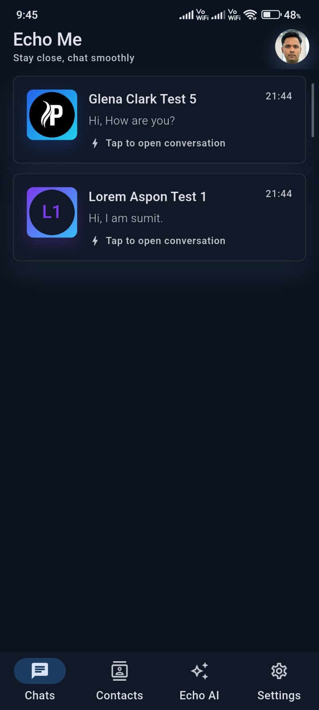
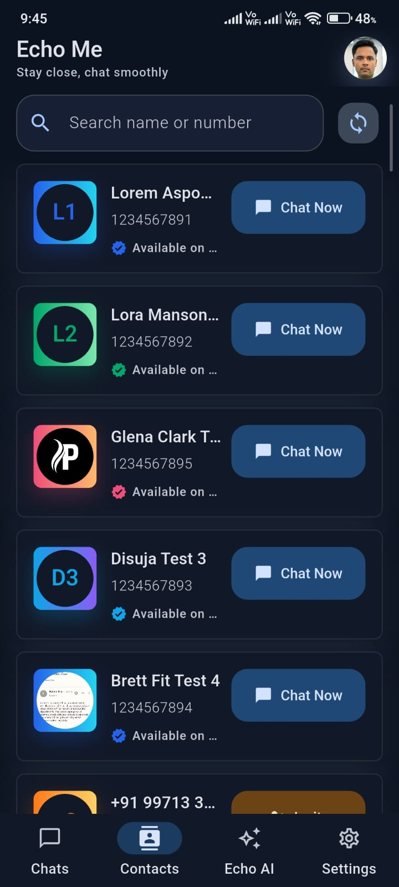
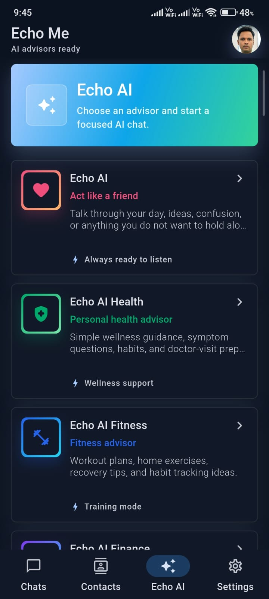
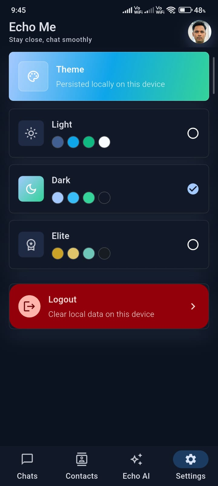
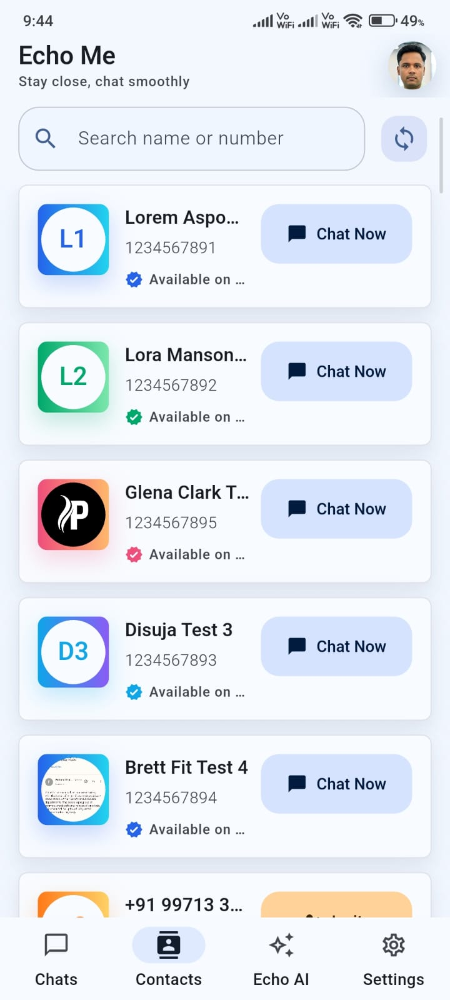
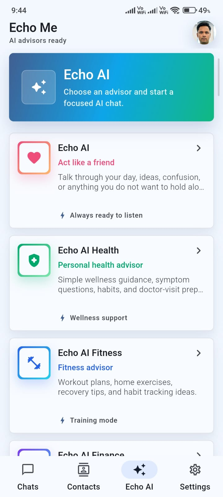
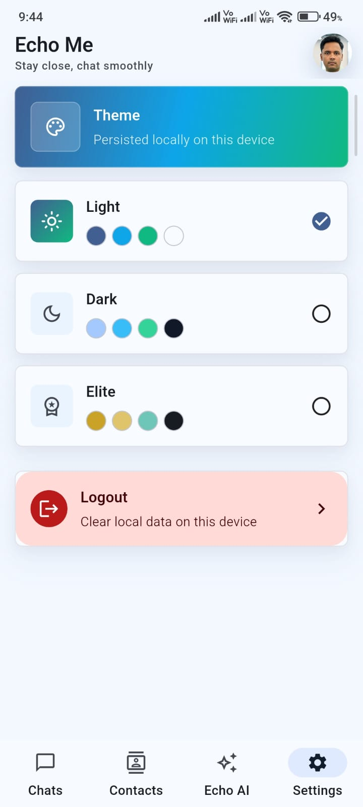
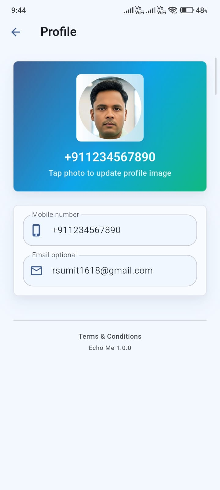

# Echo Me 💬✨

Echo Me is a polished Flutter/Firebase chat app with real-time messaging, contact discovery, beautiful themes, profile management, and an Echo AI advisor tab powered by a private Node.js backend. It is built to feel smooth, modern, and ready for real users.

The app is built to keep sensitive keys out of the APK. AI requests go through the backend in `server/`, and the backend validates Firebase login tokens before calling Gemini.

## App Preview 📱

Dark mode, light mode, AI advisors, contacts, chats, settings, and profile screens are all included.

<p align="center">
  
  
  
</p>

<p align="center">
  
  
  
</p>

<p align="center">
  
  
</p>

## What Makes It Fun 🚀

- 💬 Real-time chats that feel instant and clean.
- 🤖 Echo AI advisors for friend, health, fitness, finance, travel, study, food, career, mindfulness, and tech help.
- 🌙 Light, Dark, and Elite themes with a modern visual style.
- 🧑‍🤝‍🧑 Contact discovery with profile images and registered-user matching.
- 🟢 Online and last-seen behavior for a familiar chat experience.
- 🖼️ Profile image update flow.
- 🔐 Private backend for AI, so keys stay out of the mobile app.
- ⚡ Usage limits on the AI backend to protect free-tier usage.

## Features 🛠️

- Firebase Authentication based user sessions.
- Firestore-backed recent chats and one-to-one message threads.
- Smooth message list updates without refreshing the whole chat screen.
- Contact list with registered-user matching and profile images.
- Online/last-seen behavior and WhatsApp-style chat history timestamps.
- Profile screen with editable profile image and email.
- Theme support: Light, Dark, and Elite, persisted locally.
- Echo AI tab with advisor contacts:
  - Friend
  - Health
  - Fitness
  - Finance
  - Travel
  - Study
  - Career
  - Food
  - Mindfulness
  - Tech
- Echo AI replies in the user's language when possible, including Hindi/Hinglish.
- Private Node.js AI server with Firebase token protection and usage limits.
- Firestore and Storage rule files included.

## Project Structure 🧱

```text
lib/
  core/          Shared constants, providers, routing, errors, theme, utilities
  data/          Firebase/local models and repository implementations
  domain/        Entities and repository contracts
  features/      Auth, chats, contacts, Echo AI, home, profile, settings

server/
  api/           Vercel serverless routes
  src/           Express/local server, Firebase auth, Gemini client, advisors
```

## Clone And Run Flutter App 🏁

```powershell
git clone https://github.com/rsumit1618/echo-me.git
cd echo-me
flutter pub get
flutter run
```

Firebase files such as `android/app/google-services.json` and iOS Firebase files must match your own Firebase project if you are setting this up fresh.

## Echo AI Backend Setup 🤖🔐

The backend lives in `server/`. It must be deployed separately or run locally.

```powershell
cd server
copy .env.example .env
npm install
npm run dev
```

Edit `server/.env` with your own values. Do not commit `.env`.

```env
PORT=8080
GEMINI_API_KEY=your_google_ai_studio_key
GEMINI_MODEL=gemini-2.5-flash-lite
AI_DAILY_LIMIT_PER_USER=30
AI_PER_MINUTE_LIMIT_PER_USER=3
FIREBASE_PROJECT_ID=your_firebase_project_id
FIREBASE_SERVICE_ACCOUNT_JSON=your_firebase_service_account_json
```

`FIREBASE_SERVICE_ACCOUNT_JSON` comes from Firebase Console:

```text
Firebase Console > Project Settings > Service accounts > Generate new private key
```

Paste the full JSON value into your server environment only. Never add it to Flutter code, Git, screenshots, or chat.

## Test Backend 🧪

Health check:

```text
GET http://localhost:8080/health
```

Expected:

```json
{"ok":true}
```

Echo AI chat endpoint:

```text
POST http://localhost:8080/api/echo-ai/chat
Authorization: Bearer <firebase_id_token>
Content-Type: application/json
```

Body:

```json
{
  "advisorId": "friend",
  "messages": [
    { "role": "user", "content": "Hi, help me plan my day" }
  ]
}
```

Opening `/api/echo-ai/chat` in a browser uses `GET`, so this response is correct:

```json
{"error":"Method not allowed."}
```

## Deploy Backend On Vercel ☁️

Create a Vercel project from this repository and use:

```text
Root Directory: server
Framework Preset: Other
Install Command: npm install
Build Command: leave empty
Output Directory: leave empty
```

Add these environment variables in Vercel:

```text
GEMINI_API_KEY
GEMINI_MODEL
AI_DAILY_LIMIT_PER_USER
AI_PER_MINUTE_LIMIT_PER_USER
FIREBASE_PROJECT_ID
FIREBASE_SERVICE_ACCOUNT_JSON
```

After deployment, verify:

```text
https://your-vercel-domain.vercel.app/
https://your-vercel-domain.vercel.app/api/health
```

Then update the Flutter backend URL in:

```text
lib/features/echo_ai/echo_ai_config.dart
```

## Test Accounts 🔑

These test accounts can be used for app verification:

```text
test1@gmail.com      password: 12345678
test2@gamil.com      password: 12345678
test3@gmail.com      password: 12345678
test4@gmail.com      password: 12345678
test5@gmail.com      password: 12345678
```

Note: `test2@gamil.com` is documented exactly as provided.

## Security Notes 🛡️

- Do not commit `.env`, service account JSON, API keys, or Firebase private keys.
- Do not put Gemini/OpenAI/AI keys inside Flutter.
- Use Firebase Auth tokens to protect backend endpoints.
- Keep Firestore and Storage rules deployed for your Firebase project.
- Rotate any key immediately if it was exposed publicly.

## Useful Commands ⚙️

Flutter:

```powershell
flutter pub get
flutter run
```

Backend:

```powershell
cd server
npm install
npm run dev
```

Release APK:

```powershell
flutter build apk --release
```
